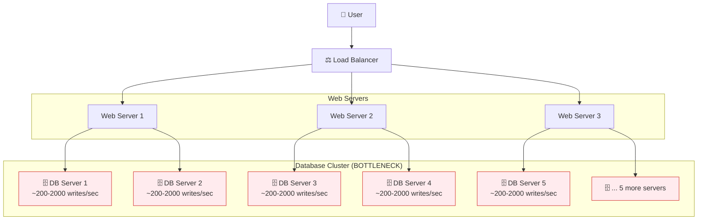
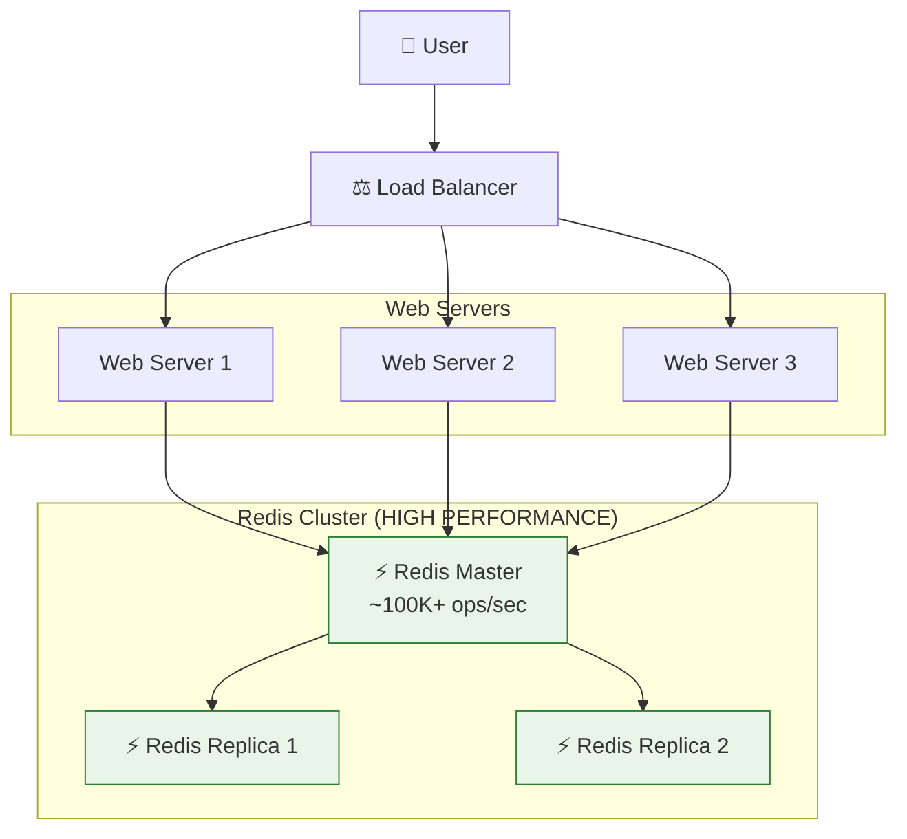

# Case Study: Fake Web Retailer - Redis Session Management

## 📊 **Tình Huống Thực Tế**

### **Vấn Đề Hiện Tại**

**Fake Web Retailer** đang gặp phải bottleneck hiệu suất nghiêm trọng trong hệ thống authentication:

```
🏬 FAKE WEB RETAILER STATISTICS
├── Average Load: 1,200 writes/second
├── Peak Load: 6,000 writes/second
├── Database Limit: 200-2,000 writes/second per server
└── Current Solution: 10 Database Servers (để handle peak)
```

### **Kiến Trúc Hiện Tại (Có Vấn Đề)**



## ❌ **Tại Sao Database Quan Hệ Không Phù Hợp?**

### **1. Giới Hạn Hiệu Suất**

```sql
-- Mỗi session update cần:
UPDATE user_sessions
SET last_activity = NOW(),
    page_views = page_views + 1,
    current_page = '/products/123'
WHERE session_token = 'abc123xyz';

-- Với 6,000 concurrent users → 6,000 UPDATE statements/second
-- Database limit: ~200-2,000 writes/sec per server
-- Cần: 6,000 ÷ 500 = 12+ database servers 💸💸💸
```

### **2. Chi Phí Scaling**

- **10 Database Servers hiện tại** → Chi phí cao
- **Phức tạp trong việc sync data** giữa các servers
- **Single point of failure** nếu không có proper replication

### **3. Over-Engineering**

- Database features như ACID, foreign keys, indexing **không cần thiết** cho session data
- Session data có **tính chất tạm thời** (expire sau vài giờ)
- **Phức tạp hóa** kiến trúc không cần thiết

## ✅ **Giải Pháp Redis**

### **Kiến Trúc Mới (Tối Ưu)**



### **So Sánh Hiệu Suất**

| Tiêu Chí         | Database (10 servers)  | Redis (1 server)      |
| ---------------- | ---------------------- | --------------------- |
| **Writes/sec**   | ~2,000 x 10 = 20,000   | **100,000+**          |
| **Reads/sec**    | ~10,000 x 10 = 100,000 | **100,000+**          |
| **Latency**      | 10-50ms                | **<1ms**              |
| **Memory Usage** | High (full rows)       | **Optimized**         |
| **TTL Support**  | Manual cleanup         | **Automatic**         |
| **Cost**         | High (10 servers)      | **Low (1-3 servers)** |

## 🛠️ **Redis Implementation Strategy**

### **1. Cấu Trúc Dữ Liệu**

```redis
# Session Storage sử dụng HASH
HSET session:abc123xyz
  user_id "12345"
  username "john_doe"
  email "john@example.com"
  last_activity "1673123456.789"
  current_page "/products/laptop-123"
  page_views "15"
  login_time "1673120000.123"

# Set TTL (auto expire)
EXPIRE session:abc123xyz 3600  # 1 hour

# Shopping cart data
HSET cart:abc123xyz
  item:1 "laptop-123|2|$999.99"
  item:2 "mouse-456|1|$29.99"
  total_items "3"
  total_value "1029.97"

EXPIRE cart:abc123xyz 86400  # 24 hours
```

### **2. Performance Benefits**

```python
# ❌ Database way (SLOW)
def update_session_db(session_token, user_data):
    cursor.execute("""
        UPDATE user_sessions
        SET last_activity = %s,
            page_views = page_views + 1,
            current_page = %s
        WHERE session_token = %s
    """, (datetime.now(), page, session_token))
    conn.commit()  # Disk I/O + WAL + Index updates
    # Time: 5-50ms per operation

# ✅ Redis way (FAST)
def update_session_redis(session_token, user_data):
    redis.hmset(f"session:{session_token}", {
        'last_activity': time.time(),
        'current_page': page,
        'page_views': redis.hincrby(f"session:{session_token}", 'page_views', 1)
    })
    redis.expire(f"session:{session_token}", 3600)
    # Time: <1ms per operation
```

## 📈 **Capacity Planning**

### **Current vs Proposed**

```
📊 BEFORE (Database Solution)
├── Peak Load: 6,000 writes/second
├── Database Capacity: 2,000 writes/sec per server
├── Required Servers: 6,000 ÷ 2,000 = 3+ servers (minimum)
├── Actual Servers: 10 (với overhead để đảm bảo)
├── Cost: HIGH 💸💸💸
└── Complexity: HIGH 🔧🔧🔧

📊 AFTER (Redis Solution)
├── Peak Load: 6,000 writes/second
├── Redis Capacity: 100,000+ ops/sec per server
├── Required Servers: 1 server (dư sức)
├── Recommended: 3 servers (1 master + 2 replicas)
├── Cost: LOW 💸
└── Complexity: LOW 🔧
```

### **ROI Analysis**

```
💰 COST REDUCTION
├── Database Servers: 10 x $200/month = $2,000/month
├── Redis Servers: 3 x $50/month = $150/month
├── Monthly Savings: $1,850/month
├── Annual Savings: $22,200/year
└── ROI: 92.5% cost reduction
```

## 🎯 **Implementation Roadmap**

### **Phase 1: Parallel Implementation**

- Setup Redis cluster alongside existing DB
- Implement read-through cache pattern
- Test with 10% traffic

### **Phase 2: Write-Through**

- Write to both Redis and DB
- Compare consistency and performance
- Gradually increase traffic %

### **Phase 3: Full Migration**

- Switch all reads to Redis
- Keep DB as backup for 30 days
- Monitor performance metrics

### **Phase 4: Cleanup**

- Remove database dependencies
- Optimize Redis configuration
- Document new architecture

## 🔧 **Technical Considerations**

### **Data Consistency**

```python
# Eventual consistency acceptable for sessions
# Users can re-login if session lost (rare)
# Shopping cart: use Redis persistence + replication
```

### **High Availability**

```python
# Redis Cluster with replication
# Automatic failover
# Data persistence (RDB + AOF)
```

### **Monitoring**

```python
# Key metrics to track:
# - Operations per second
# - Memory usage
# - Hit/miss ratios
# - Latency percentiles
```

## 📊 **Expected Results**

```
🚀 PERFORMANCE IMPROVEMENTS
├── Response Time: 10-50ms → <1ms (10-50x faster)
├── Throughput: 20K ops/sec → 100K+ ops/sec (5x higher)
├── Server Count: 10 → 3 (70% reduction)
├── Infrastructure Cost: $2000 → $150 (92% reduction)
├── Complexity: High → Low
└── Scalability: Limited → Excellent
```

---

## 🎉 **Kết Luận**

Việc chuyển từ database quan hệ sang Redis cho session management là một **quyết định kiến trúc thông minh**:

✅ **Giảm 92% chi phí infrastructure**
✅ **Tăng 10-50x hiệu suất**
✅ **Đơn giản hóa kiến trúc**
✅ **Tự động TTL management**
✅ **Dễ scale horizontal**

**Redis HASH** là perfect fit cho session data vì:

- **Key-value mapping** tự nhiên (session_token → user_data)
- **Atomic operations** cho updates
- **Memory efficiency**
- **TTL support** tự động cleanup expired sessions
