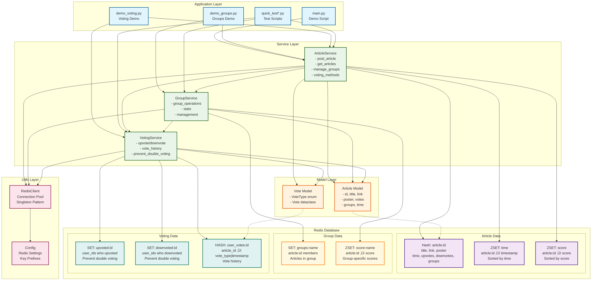

# Redis Voting System - System Architecture

## Tổng quan hệ thống

Hệ thống Redis Voting System được thiết kế với kiến trúc phân lớp rõ ràng, sử dụng Redis làm database chính với các cấu trúc dữ liệu tối ưu cho từng use case.

## Mermaid Diagram

```mermaid
graph TB
    %% Application Layer
    subgraph "Application Layer"
        MAIN["main.py<br/>Demo Script"]
        DEMO["demo_groups.py<br/>Groups Demo"]
        VOTE_DEMO["demo_voting.py<br/>Voting Demo"]
        TEST["quick_test*.py<br/>Test Scripts"]
    end

    %% Service Layer
    subgraph "Service Layer"
        AS["ArticleService<br/>- post_article<br/>- get_articles<br/>- manage_groups<br/>- voting_methods"]
        GS["GroupService<br/>- group_operations<br/>- stats<br/>- management"]
        VS["VotingService<br/>- upvote/downvote<br/>- vote_history<br/>- prevent_double_voting"]
    end

    %% Model Layer
    subgraph "Model Layer"
        ARTICLE["Article Model<br/>- id, title, link<br/>- poster, votes<br/>- groups, time"]
        VOTE["Vote Model<br/>- VoteType enum<br/>- Vote dataclass"]
    end

    %% Utils Layer
    subgraph "Utils Layer"
        RC["RedisClient<br/>Connection Pool<br/>Singleton Pattern"]
        CONFIG["Config<br/>Redis Settings<br/>Key Prefixes"]
    end

    %% Redis Data Structures
    subgraph "Redis Database"
        subgraph "Article Data"
            HASH["Hash: article:id<br/>title, link, poster<br/>time, upvotes, downvotes, groups"]
            TIME_ZSET["ZSET: time<br/>article:id ‚Üí timestamp<br/>Sorted by time"]
            SCORE_ZSET["ZSET: score<br/>article:id ‚Üí score<br/>Sorted by score"]
        end

        subgraph "Group Data"
            GROUP_SET["SET: groups:name<br/>article:id members<br/>Articles in group"]
            GROUP_SCORE["ZSET: score:name<br/>article:id ‚Üí score<br/>Group-specific scores"]
        end

        subgraph "Voting Data"
            UPVOTED_SET["SET: upvoted:id<br/>user_ids who upvoted<br/>Prevent double voting"]
            DOWNVOTED_SET["SET: downvoted:id<br/>user_ids who downvoted<br/>Prevent double voting"]
            USER_VOTES["HASH: user_votes:id<br/>article_id ‚Üí vote_type|timestamp<br/>Vote history"]
        end
    end

    %% Connections - Application to Service
    MAIN --> AS
    DEMO --> AS
    DEMO --> GS
    VOTE_DEMO --> AS
    VOTE_DEMO --> VS
    TEST --> AS
    TEST --> GS
    TEST --> VS

    %% Service Layer connections
    AS --> GS
    AS --> VS
    GS --> VS

    %% Service to Model
    AS --> ARTICLE
    AS --> VOTE
    GS --> ARTICLE
    VS --> ARTICLE
    VS --> VOTE

    %% Service to Utils
    AS --> RC
    GS --> RC
    VS --> RC
    RC --> CONFIG

    %% Service to Redis
    AS --> HASH
    AS --> TIME_ZSET
    AS --> SCORE_ZSET
    GS --> GROUP_SET
    GS --> GROUP_SCORE
    VS --> UPVOTED_SET
    VS --> DOWNVOTED_SET
    VS --> USER_VOTES

    %% Model to Redis
    ARTICLE -.-> HASH
    VOTE -.-> USER_VOTES

    %% Styling
    classDef appLayer fill:#e1f5fe,stroke:#01579b,stroke-width:2px
    classDef serviceLayer fill:#e8f5e8,stroke:#1b5e20,stroke-width:2px
    classDef modelLayer fill:#fff3e0,stroke:#e65100,stroke-width:2px
    classDef utilsLayer fill:#fce4ec,stroke:#880e4f,stroke-width:2px
    classDef redisData fill:#f3e5f5,stroke:#4a148c,stroke-width:2px
    classDef redisGroup fill:#fff8e1,stroke:#ff6f00,stroke-width:2px
    classDef redisVoting fill:#e0f2f1,stroke:#00695c,stroke-width:2px

    class MAIN,DEMO,VOTE_DEMO,TEST appLayer
    class AS,GS,VS serviceLayer
    class ARTICLE,VOTE modelLayer
    class RC,CONFIG utilsLayer
    class HASH,TIME_ZSET,SCORE_ZSET redisData
    class GROUP_SET,GROUP_SCORE redisGroup
    class UPVOTED_SET,DOWNVOTED_SET,USER_VOTES redisVoting
```

## Giải thích kiến trúc

### 🏗️ Phân lớp hệ thống

#### 1. Application Layer (Tầng ứng dụng)

- **main.py**: Demo script chính cho tính năng posting/fetching
- **demo_groups.py**: Demo tính năng groups
- **demo_voting.py**: Demo tính năng voting system
- **quick_test\*.py**: Test scripts để kiểm tra tính năng

#### 2. Service Layer (Tầng dịch vụ)

- **ArticleService**: Xử lý logic posting, fetching articles và quản lý groups
- **GroupService**: Xử lý logic groups, thống kê và management
- **VotingService**: Xử lý logic voting (upvote/downvote), vote history và prevent double voting

#### 3. Model Layer (Tầng mô hình)

- **Article Model**: Định nghĩa cấu trúc dữ liệu bài viết với fields: id, title, link, poster, upvotes, downvotes, groups, time
- **Vote Model**: Định nghĩa VoteType enum và Vote dataclass

#### 4. Utils Layer (Tầng tiện ích)

- **RedisClient**: Connection pool v·ªõi singleton pattern
- **Config**: Cấu hình Redis connection và key prefixes

### 🗄️ Redis Data Structures

#### Article Data (Dữ liệu bài viết)

- **Hash** `article:id`: L∆∞u metadata (title, link, poster, time, upvotes, downvotes, groups)
- **ZSET** `time`: Sắp xếp articles theo thời gian
- **ZSET** `score`: Sắp xếp articles theo điểm

#### Group Data (Dữ liệu groups)

- **SET** `groups:name`: Chứa article IDs thuộc group
- **ZSET** `score:name`: Chứa scores của articles trong group cụ thể

#### Voting Data (Dữ liệu voting)

- **SET** `upvoted:id`: Chứa user IDs đã upvote article
- **SET** `downvoted:id`: Chứa user IDs đã downvote article
- **HASH** `user_votes:id`: Chứa vote history của user (article_id → vote_type|timestamp)

### 🔄 Data Flow Examples

#### 1. Post Article with Groups

1. T·∫°o Hash cho metadata
2. Thêm vào time ZSET
3. Thêm vào score ZSET
4. Thêm vào group SETs
5. Thêm vào group score ZSETs

#### 2. Get Articles by Group

1. Query groups:name SET để lấy article IDs
2. Fetch Hash data cho t·ª´ng article
3. Tạo Article objects và return

#### 3. Vote on Article

1. Thêm user vào upvoted/downvoted SET
2. Update upvotes/downvotes trong Hash
3. Update score trong ZSETs
4. Update group scores
5. Save vote history trong user_votes

### 🎯 Ưu điểm

- ✅ **Tách biệt rõ ràng** giữa các layers
- ✅ **Redis structures tối ưu** cho từng use case
- ✅ **Scalable** và dễ mở rộng
- ✅ **Consistent** data sync giữa global và group scores
- ‚úÖ **Efficient** queries v·ªõi Redis native operations
- ✅ **Voting system hoàn chỉnh** với prevent double voting

### 🚀 Tính năng đã implement

- [x] Posting articles v·ªõi groups
- [x] Fetching articles theo time/score
- [x] Fetching articles theo groups
- [x] Qu·∫£n l√Ω groups (add/remove articles)
- [x] Thống kê groups
- [x] **Voting system (upvote/downvote)** - **COMPLETED**
- [x] Vote history và statistics
- [x] Prevent double voting
- [ ] Comment system
- [ ] User authentication
